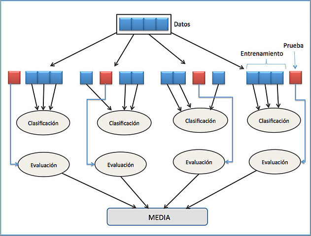
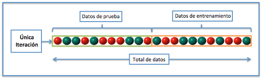

```{r setup, include=FALSE}
knitr::opts_chunk$set(echo = TRUE)
knitr::opts_chunk$set(cache  = TRUE)
```


<br>


Este método consiste en repetir el experimento varia veces partiendo los datos y luego calcular la media obtenidas de las medias de evaluación . Con esto se busca estimar la precisión del modelo  y optimizar los parámetros de este.


<br>





***


# Partición simple

Este método consiste en partir de forma aleatoria del conjunto de datos en dos nuevos conjuntos, de los cuales uno de esos sirve para construir los modelos y el otro para validar su efectividad.

<br>

<br>


```{r eval=FALSE}
library(caret)
library(devtools)


set.seed(2018) # semilla aleatoria para que al correr siempre de mismo resultado

index <- createDataPartition(data$y, p=0.8, list = F)
train <- data[index, ] # conjunto de entrenamiento
test <- data[-index, ] # Conjunto de prueba

```

* `p :` Permite definir el total de unidades usadas en el conjunto de entrenamiento.
* `data$y :` Variabe dependiente de la base de datos.
* `list = F : ` Que no me imprima los resultados como una lista.

**Nota:** Este método puede ser muy ágil para procesar los datos aunque puede no ofrecer una validación confiable ya que en ocasiones el resultado de la validación depende de como partamos los datos.


# Validación cruzada de K iteraciones


Los datos son divididos en k subconjuntos, de los cuales k-1 subconjuntos son tomados como conjunto de entrenamiento y el subconjunto restante como conjunto de prueba. Este proceso es repetido k iteraciones.

El error total es calculado de la siguiente manera :

$$E = \frac{1}{K}\sum_{i=1}^k E_i$$


<br>

<br>


```{r message=FALSE}
library(caret)
data <- sample(1:20, size = 80, replace = TRUE)
(folds <- groupKFold(data, k = 10))


```


**Nota:** Aunque este método es bastante bueno para la validación su desventaja es su costo y lentitud computacional. En la práctica el número de k es elegido dependiendo del tamaño del conjunto de datos pero lo más común es elegir k = 10.


# Validación cruzada aleatoria


Este método consiste de tomar de forma aleatoria cierta cantidad de los individuos de la bases de datos para forma el conjunto de entrenamiento. Este proceso se repite k iteraciones.

El error total es calculado de la siguiente manera :

$$E = \frac{1}{K}\sum_{i=1}^k E_i$$

<br>

<br>

```{r}
(flds <- createFolds(data, k = 10,list = TRUE, returnTrain = T))
```

* `returnTrain = T :` Retornar el conjunto de entrenamiento, si se pone en falta retorna el conjunto de prueba.

**Nota:** La complicación de este método se puede dar cuando en la selección aleatoria en las k iteraciones puede ocurrir que queden unidades sin probar.

# Validación cruzada dejando uno fuera

Este método consiste en realizar  N iteraciones donde en cada iteración se deja un solo dato en el conjunto de prueba.


El error total es calculado de la siguiente manera :

$$E = \frac{1}{N}\sum_{i=1}^N E_i$$

<br>

<br>

```{r message=FALSE}
library(DMwR)
data(swiss)

## First the user defined function (note: can have any name)
user.rpart <- function(form, train, test) {
    require(rpart)
    model <- rpart(formula = form,data =  train)
    preds <- predict(model, test)
  
}

## Now the evaluation
eval.res <- loocv(learner('user.rpart'),
                  dataset(Infant.Mortality ~ ., swiss),
                  loocvSettings(1234))

## Check a summary of the results
summary(eval.res)
```

* `loocvSettings(1234) : ` Semilla aleatoria.
* `learner('user.rpart') :` modelo a usar.
* `dataset(Infant.Mortality ~ ., swiss) :` Formula del modelo a usar y base de datos.

**Nota:** Este método ofrece un errore muy bajo aunque presenta un costo computacional muy grande.

# Referencias

* https://www.udemy.com/r-data-science/learn/v4/t/lecture/8980306?start=0
* https://es.wikipedia.org/wiki/Validaci%C3%B3n_cruzada
* https://www.rdocumentation.org/